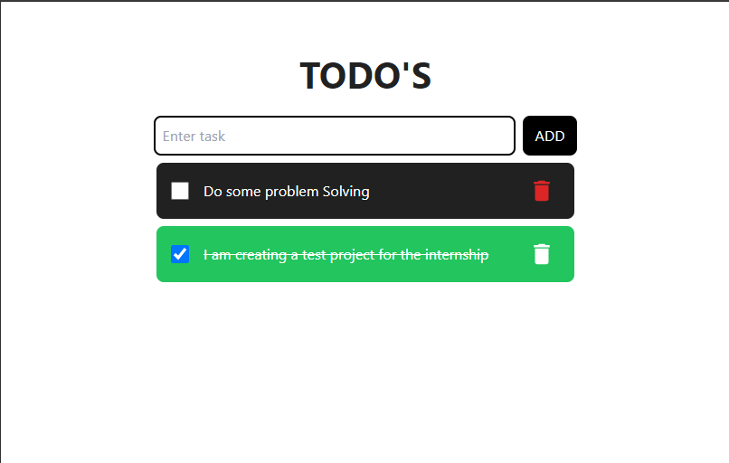

# TODO WITH REDUX

To get started with the project, clone the project on your machine.

`Install the dependencies using: npm install`

`To start the development server use: npm run dev`

Laptop Look

Tablet Look

Mobile Look
